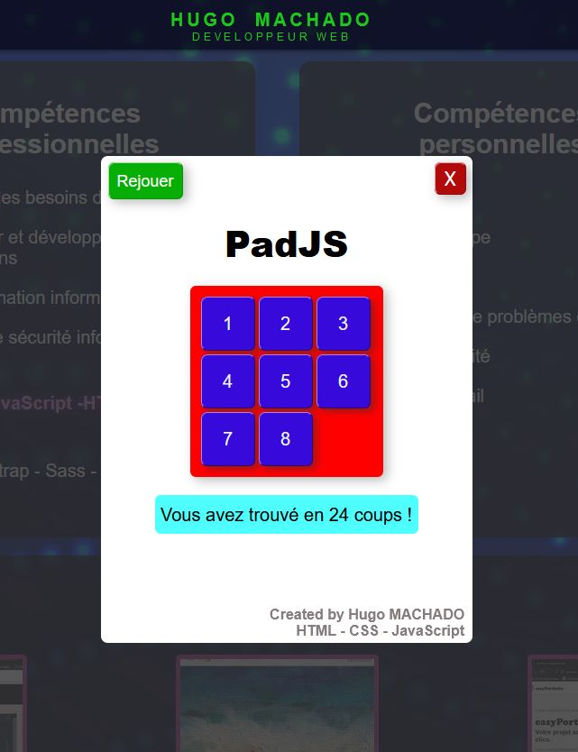

# PadJs

In this game you have to put the keys in order in a minimum of moves.

### Screenshot

## Table of Contents

1. [General Info](#general-info)
2. [Technologies](#technologies)
3. [Installation](#installation)
4. [Contributing](#contributing)

## General Info

I added this game in my portfolio, wich is a php project.
You can see it at:
[portfolio.hugo-machado.com](https://portfolio.hugo-machado.com)

I include the html file in the template and add a link for the css sheet and a script tag for the js file.
## Technologies
I used html, css and javascript from scratch.

HTML - CSS - JavaScript
## Installation

Simply include the html file in your template.
Link the css sheet and add a script tag for the js file.
    
## Contributing

Contributions are always welcome!

Feel free to propose changes by creating Pull Requests. If you don't have write acces, editing a file will create a Fork of this project for you to save your proposed changes to. Submitting a change to a file will write it to a new Branch in your Fork, so you can send a Pull Request.
